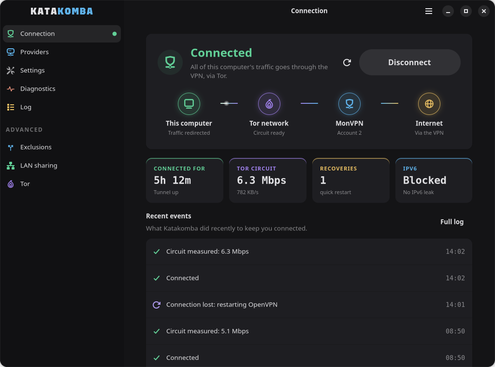
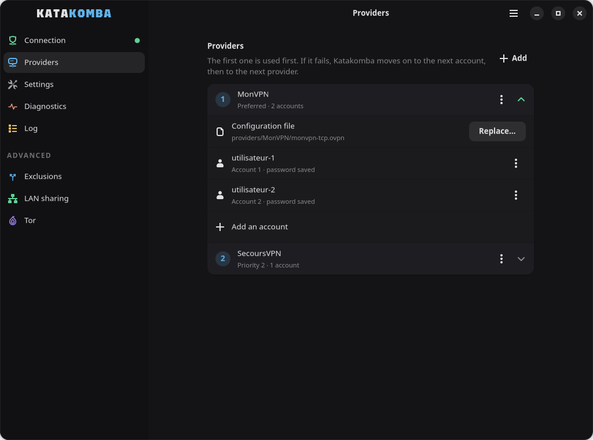

<p align="center"></p>

# Katakomba — v3.7.0


[](https://github.com/Derbosoft/Katakomba/actions/workflows/tests.yml)
[](https://github.com/Derbosoft/Katakomba/releases/latest)


> [Documentation en français](README.fr.md)

Route **all your network traffic through OpenVPN tunneled inside Tor** on Ubuntu/Debian. A systemd daemon runs in the background and automatically manages Tor, OpenVPN, IPv6 blocking, LAN sharing, and connectivity monitoring — with a full GUI and CLI.

*Katakomba was formerly called "Tor-VPN Manager": an existing installation is migrated automatically (see [Migrating from Tor-VPN Manager](#migrating-from-tor-vpn-manager)).*

---

## Table of Contents

1. [Architecture](#architecture)
2. [Requirements](#requirements)
3. [Installation](#installation)
4. [Project Structure](#project-structure)
5. [Graphical Interface](#graphical-interface)
6. [CLI `katakomba`](#cli-katakomba)
7. [Daemon Internals](#daemon-internals)
8. [iptables Chains](#iptables-chains)
9. [Failover & Watchdog](#failover--watchdog)
10. [LAN Sharing](#lan-sharing)
11. [Split DNS — Local Domains](#split-dns--local-domains)
12. [Tor Configuration (torrc)](#tor-configuration-torrc)
13. [Automatic Network Repair](#automatic-network-repair)
14. [config.json Format](#configjson-format)
15. [Tests](#tests)
16. [Translations](#translations)
17. [Security](#security)
18. [Getting Started](#getting-started)
19. [Uninstallation](#uninstallation)

---

## Architecture

```
User
    │
    ├── katakomba gui          ──►  GUI (main.py → gui/app.py)
    │                              • Reads/writes config.json and torrc
    │                              • Drives the service through polkit
    │                              • Watches in the background, notifies drops
    │                              • Never touches network processes
    │
    ├── katakomba <command>    ──►  CLI wrapper (/usr/local/bin/katakomba)
    │                              • Calls systemctl
    │
    └── systemd              ──►  katakomba.service
                                   │
                                   └── daemon/  (root)
                                         │
                                         ├── Tor  (subprocess, port 9050/9051)
                                         │         └── optional torrc
                                         │
                                         ├── OpenVPN ──► SOCKS5 127.0.0.1:9050 ──► Tor ──► Internet
                                         │              (tunX, redirect-gateway)
                                         │
                                         ├── iptables  (IPv6 block, LAN sharing)
                                         │
                                         └── Watchdog  (connectivity)


Full network flow:
  App → tunX → OpenVPN → SOCKS5:9050 → Tor → Tor relays → VPN server → Internet
```

The GUI and the daemon are **fully decoupled**: the GUI only writes config files and calls systemd. It never monitors processes and cannot interfere with an active connection.

---

## Requirements

| Component | Min version | Role |
|-----------|-------------|------|
| Ubuntu / Debian | 24.04 / 13 | Base system |
| Python | 3.8+ | Daemon + GUI |
| GTK 4 + libadwaita | 1.5+ | Graphical interface (`python3-gi`, `python3-gi-cairo`, `gir1.2-gtk-4.0`, `gir1.2-adw-1`, `librsvg2-common`) |
| tor | — | SOCKS5 proxy and Tor network |
| openvpn | 2.4+ | Encrypted tunnel to VPN provider |
| dnsmasq | — | **Optional** — DHCP server, only for LAN sharing |
| curl | — | Throughput measurement and connectivity tests |
| systemd + systemd-resolved | — | Service management and DNS |

---

## Installation

### `.deb` package (recommended)

Download `katakomba_<version>_all.deb` from the **[latest release](https://github.com/Derbosoft/Katakomba/releases/latest)**, then:

```bash
sudo apt install ./katakomba_<version>_all.deb
```

`apt` installs the dependencies and configures everything. Then open "Katakomba" from the applications menu: the wizard takes over (see *Getting Started*). The machine's administrators (`sudo` group) get access to the interface. For another account: `sudo katakomba autoriser <user>`.

> **Right after installing**, log out and back in: your session was opened before your account got access. The interface tells you when needed. On distributions that ship `sg` (Debian notably), `katakomba gui` handles it without logging out.

**Build the package** from source, no root needed:
```bash
bash packaging/build-deb.sh          # → dist/katakomba_<version>_all.deb
```
The `Maintainer` field comes from `DEB_MAINTAINER`, or else from `git config user.name` / `user.email`. It is visible to anyone inspecting the package.

The package reuses `install.sh` in "package mode" (`KATAKOMBA_PAQUET=1`, called by `postinst`). There is therefore a single installation procedure, and both paths configure the system identically.

### From source

```bash
sudo bash install.sh
```

The installer runs **7 steps**:

**1. Dependencies**
```bash
apt install tor openvpn python3 curl python3-gi python3-gi-cairo gir1.2-gtk-4.0 gir1.2-adw-1 librsvg2-common
```
`dnsmasq` is only used by LAN sharing (disabled by default): since v3.6.1 it is installed only if already present or if sharing is configured, rather than installed and immediately disabled. To add it later: `sudo apt install dnsmasq`.

> **`KATAKOMBA_SKIP_APT=1` — replay the installer with no network (v3.6.3).** Useful when only the systemd unit or the CLI changed on an already-installed machine, all the more so when the only available network path is the tunnel this daemon is in the middle of bringing up.
>
> ```bash
> sudo KATAKOMBA_SKIP_APT=1 bash install.sh
> ```
>
> The guard is not a plain override: it **verifies every dependency is present** (`tor`, `openvpn`, `python3`, `curl`, GTK 4 and libadwaita 1.5+) and **refuses to continue** otherwise. Skipping `apt` on an incomplete machine would produce a half-working install, harder to diagnose than an outright failure.

**2. Configuration directory**
- Creates `/etc/katakomba/` as `root:katakomba 2770` (katakomba group: root-less GUI)
- Creates `/var/lib/katakomba/` (`root`, 0755) and moves a previous version's Tor data there (guards kept)
- Installs a **default torrc** (long, stable circuits) if none exists yet — a customized torrc is never overwritten
- Auto-migrates any pre-v3.2 config from `/root/.config/tor-vpn-manager/` or `/opt/tor-vpn-manager/`
- Never writes as root through a symlink planted in this directory (which the group can modify)

**3. Program code (v3.7.0)**
- Copies the program to `/opt/katakomba`, owned by `root:root`; only `providers/` stays writable by the `katakomba` group
- Carries over the `.ovpn` files from the old `providers/` without overwriting anything, and turns absolute `.ovpn` paths in `config.json` into relative ones

> **Why.** Up to v3.6.4 the service ran the code **from the user's clone**. Any program running under that account could rewrite `daemon/*.py` and get root at the next restart, with no password. **After changing the source code, rerun `sudo bash install.sh`**: the service runs the copy in `/opt`, not the clone.

**4. System services**
- Enables and starts `systemd-resolved`
- **Disables and stops** the system `tor` service — the daemon manages Tor directly as a subprocess for precise control over startup, logs, and restarts

**5. Systemd service**
Creates `/etc/systemd/system/katakomba.service`:
- `ExecStartPre`: iptables cleanup script (removes orphan rules from the previous session)
- `ExecStart`: `python3 -m daemon` from `/opt/katakomba`
- `ExecStopPost`: same cleanup script
- `Restart=on-failure` with a 20s delay, unlimited attempts (`StartLimitIntervalSec=0`)
- `Type=notify` + `WatchdogSec=90`: the daemon reports liveness every ~3s; if it freezes (deadlock), systemd kills and relaunches it
- `KillMode=control-group`: systemd kills the entire cgroup (Tor, OpenVPN, dnsmasq included)
- `TimeoutStopSec=30`
- `RestartPreventExitStatus=78`: with no provider configured, the daemon exits with 78 and is not relaunched every 20 s
- `RuntimeDirectory=katakomba` (0700): `auth.tmp`, validated copies of the `.ovpn` and torrc, dnsmasq pid — removed by systemd on stop, even after a crash
- Hardening: `NoNewPrivileges`, `PrivateTmp`, `ProtectHome`, `ProtectSystem=full` with `ReadWritePaths` limited to `/etc/katakomba` and `/etc/systemd/resolved.conf.d`

**6. Sleep/wake hook**
Installs `/lib/systemd/system-sleep/katakomba-sleep`: automatically restarts the daemon 3 seconds after each wake from sleep or hibernation — **if it was running** (`try-restart` since v3.7.0; `restart` also started a deliberately stopped service). Without this hook, Tor circuits are stale after wake but port 9050 is still open, causing OpenVPN to reconnect without going through Tor.

**7. CLI and GUI launcher**
- Installs `/usr/local/bin/katakomba` (copy of `katakomba-cli.sh`)
- Installs the icon and creates `/usr/share/applications/org.katakomba.Katakomba.desktop` (application menu, no autostart). It carries the application ID: without it, GNOME would not show the app's notifications. The old `katakomba.desktop` is removed
- Installs the polkit rule `/usr/share/polkit-1/rules.d/50-katakomba.rules` (connect and disconnect without a password for the `katakomba` group) and the prompts in `/usr/share/polkit-1/actions/org.katakomba.policy`

### Migrating from Tor-VPN Manager

Katakomba was called "Tor-VPN Manager" up to v3.7.0. `install.sh` (and the `.deb` package, which replaces the old `tor-vpn-manager` package) takes over an existing installation without losing anything:

| Old | New |
|---|---|
| `tor-vpn-manager` service | `katakomba` service (restarted if the old one was running) |
| `tor-vpn` command | `katakomba` command |
| `torvpn` group | `katakomba` group — **same GID**: members kept, open sessions need no re-login |
| `/etc/tor-vpn-manager` | `/etc/katakomba` (settings, accounts, torrc) |
| `/var/lib/tor-vpn-manager` | `/var/lib/katakomba` (Tor data: guards are kept) |
| `/opt/tor-vpn-manager/providers` | `/opt/katakomba/providers` |
| `.tvpn` backups | `.katakomba` backups (`.tvpn` files can still be imported) |

The old service is stopped first: its cleanup removes its iptables rules, split DNS and dnsmasq. Hard-coded paths (absolute `.ovpn` paths in `config.json`, the torrc `DataDirectory`) are rewritten, never through a symlink. The old unit, sleep hook, `tor-vpn` command (only if it is ours) and launcher are removed.

> **Upstream firewall blocking all non-tunnel traffic:** the tunnel is down during the migration, so `apt` cannot download anything. The dependencies being already installed, run: `sudo KATAKOMBA_SKIP_APT=1 bash install.sh`

---

## Project Structure

```
katakomba/
├── main.py              Interface entry point (starts gui/app.py)
├── constants.py         Constants shared by the interface and the daemon (paths, default config)
├── validation.py        Allowlists for .ovpn directives and torrc options (daemon + GUI)
├── adaptation.py        Automatic adaptation of a provider's .ovpn (GUI)
├── i18n.py              Translations: language choice, reading the po/ catalogues
├── install.sh           Ubuntu/Debian installation script (source, or package mode)
├── uninstall.sh         Uninstallation (katakomba uninstall, package prerm)
├── packaging/           .deb package: build-deb.sh, control, postinst/prerm/postrm, launcher
├── repair_network.sh    Network repair script (iptables, routes, DNS cleanup)
├── katakomba-cli.sh     CLI source — copied to /usr/local/bin/katakomba by install.sh
├── run-tests.sh         Test-suite runner (+ network fingerprint before/after)
├── assets/              Logo (SVG + PNG), emblem, banner, symbolic icons (icones/)
├── polkit/              polkit rule (password-free connection) and prompts for privileged actions
├── po/                  Translation catalogues (en, es, de, it, pt) and katakomba.pot template
├── outils/              Development tools: catalogues (traductions.py), icons (icones.py)
├── template.ovpn        Annotated template to create a compatible .ovpn file
│
├── daemon/              Daemon package (launched by systemd via python3 -m daemon)
│   ├── __init__.py      Daemon class (aggregates all mixins) + main()
│   ├── __main__.py      python3 -m daemon entry point
│   ├── core.py          DaemonCore — shared state, config, logging, signals, orchestration
│   ├── tor.py           TorMixin — Tor start/stop, optional torrc, ControlPort
│   ├── network.py       NetworkMixin — gateway, SOCKS, Tor /32 route protection
│   ├── firewall.py      FirewallMixin — iptables/ip6tables, IPv6 block, LAN sharing, dnsmasq
│   ├── dns.py           DNSMixin — split DNS via systemd-resolved drop-in
│   ├── openvpn.py       OpenVPNMixin — OpenVPN loop, provider failover
│   └── watchdog.py      WatchdogMixin — connectivity monitoring, full restart
│
├── gui/                 Graphical interface (GTK 4 + libadwaita)
│   ├── app.py           Application: theme, icons, access check
│   ├── fenetre.py       Window: sidebar, service tracking, advanced mode
│   ├── modele.py        UI-free logic (config, torrc, backups, service)
│   ├── veilleur.py      When to warn about a drop (UI-free)
│   ├── outils.py        Dialogs, background tasks, file choosers
│   ├── page_*.py        Pages: connection, providers, settings, diagnostics,
│   │                    journal, exclusions, LAN sharing, Tor
│   ├── assistant.py     Setup wizard (first launch)
│   └── style.css        Katakomba colours
│
└── providers/           .ovpn files per provider (not versioned)
    └── <ProviderName>/
        └── <file>.ovpn
```

**Files generated at install / runtime:**
```
/opt/katakomba/         Deployed code (root:root); providers/ is root:katakomba 2770

/etc/katakomba/         Written by the GUI (root:katakomba 2770) — never by the daemon
├── config.json               Main config (mode 660)
└── torrc                     Custom Tor config (mode 660, optional)

/run/katakomba/         Written by the daemon (root, 0700, volatile)
├── auth.tmp                  Temporary OpenVPN credentials (created/deleted each session)
├── openvpn.conf              Validated copy of the .ovpn, read by OpenVPN
├── torrc                     Validated copy of the torrc, read by Tor
└── dnsmasq.pid               LAN sharing

/var/lib/katakomba/     Written by the daemon (root, 0755, persistent)
├── tor-routes.txt        Active Tor /32 routes (persisted across restarts)
└── tor_data/                 Tor data (debian-tor, 0700)

/etc/systemd/system/katakomba.service
/etc/systemd/resolved.conf.d/katakomba-split.conf   (if split DNS is enabled)
/lib/systemd/system-sleep/katakomba-sleep
/usr/local/bin/katakomba
/usr/local/lib/katakomba-cleanup.sh
/usr/share/applications/org.katakomba.Katakomba.desktop
/usr/share/icons/hicolor/scalable/apps/katakomba.svg
/usr/share/polkit-1/rules.d/50-katakomba.rules
/usr/share/polkit-1/actions/org.katakomba.policy

~/.config/katakomba/interface.json          Interface preferences (per account)
~/.config/autostart/org.katakomba.Katakomba.desktop   (if "Lancer à l'ouverture de session")
```

---

## Graphical Interface

<p align="center"></p>

### Launch

```bash
katakomba gui                  # as your user (katakomba group) — never with sudo
katakomba gui --arriere-plan   # without opening the window (used at session login)
python3 main.py                # direct launch, from the sources
```

The interface is built with **GTK 4 and libadwaita** and follows the layout of GNOME applications: a sidebar leads to the pages, and everything folds into a single column when the window is narrow. It is always dark and deliberately sober: neutral greys, with one colour per step of the route (green, violet, blue, amber). Motion only shows what is really happening: established steps glow softly; while connecting, the current step spins and breathes (for Tor, a ring follows its bootstrap progress) and each step lights up the moment it is established; once connected, a packet travels along the route now and then. Animations stop while the window is hidden and follow GNOME's "Reduce animation" setting.

**Six languages:** English, French, Spanish, German, Italian and (Brazilian) Portuguese. The interface follows the system language; **Settings → Interface → Language** forces another one, applied at once, without restarting. A language Katakomba does not know falls back to English. Diagnostics (`katakomba doctor`) follow the same language. The service log stays in French: it is a technical record, quoted as-is in reports. The translations were made from French; review by native speakers is welcome (see [Translations](#translations)).

**Everything is saved immediately:** there is no "Save" button any more. When a setting only applies at the next service start, a banner offers **Restart now**. **Connecting, disconnecting and restarting need no password** for members of the `katakomba` group, from their local session (polkit rule, see [Security](#security)). Connecting at boot and repairing the network always ask for the administrator password. The prompt then says what Katakomba wants to do, instead of a generic "run … as the super user". A cancelled prompt is not an error.

With no provider configured, the **setup wizard** opens automatically: provider file, credentials, then a live-tracked connection. It stays available from the **Add** button of the Providers page and from the main menu (☰).

**Simple / advanced mode:** by default the sidebar shows *Connection*, *Providers*, *Settings*, *Diagnostics* and *Log*. **Advanced mode**, in the main menu, adds *Exclusions*, *LAN sharing*, *Tor* and the circuit-quality settings. The choice is remembered. An installation already using those settings (exclusions, local DNS, LAN sharing, modified circuit threshold) starts in advanced mode: nothing is hidden from someone who uses it.

### Background and notifications

**Closing the window does not quit Katakomba**: the interface keeps watching the connection and warns you with a desktop notification:

| Situation | Notification |
|---|---|
| Tunnel down for more than 20 s | **Connection lost**, with the reason, updated if the reason changes |
| Tunnel back after a warning | **Connection restored**, with how long it was down, in place of the warning |
| Service stopped without you asking | **Katakomba is stopped**, with a **Connect** button |
| First connection, window closed | **Katakomba is connected**, with the provider |
| No tunnel 2 min after startup | **Still connecting**, with the reason |

All notifications share **one slot**: each replaces the previous one, never a pile of stale messages. Quick recoveries (the measured median is 12 s) stay silent, as does anything you just asked for yourself (connect, stop, restart, repair). Nothing is notified while you are looking at the window. Clicking a notification reopens the window.

To really quit: main menu → **Quit**. Opening Katakomba again from the application menu brings back the hidden window. Three per-account settings live in **Settings → Interface**: keep running in the background, notifications, hidden launch at session login.

The interface measures nothing itself: every 3 s it reads the state the daemon already publishes on its socket, with no network traffic.

### Connection page

A status card at the top: **Connected**, **Reconnecting…** with its reason (slow circuit, OpenVPN restart, full restart, refused account), **Disconnected**, and a single button to connect or disconnect.

Inside the card, **the path your traffic takes**, in four steps: *This computer* → *Tor network* → *the VPN* (named after the provider, with the account in use) → *Internet*. Each step takes the colour of its state: cyan when working, violet while connecting or reconnecting, grey when stopped, red on error. During a reconnection you see at a glance where it is stuck: Tor still ready, VPN in progress. In a narrow window the path turns vertical and the button moves below the status.

Below, four figures: **connected for**, **Tor circuit** speed (measured on connection, with its age), **recoveries** since the service started (quick restarts and full restarts) and **IPv6** (blocked or not). Then the **recent events**, translated from the log. None of this generates traffic: it is the state the daemon already publishes.

The coloured dot next to *Connection* in the sidebar sums up the state from any page.

### Providers page

<p align="center"></p>

Manages VPN providers and their accounts. List order defines connection and failover priority; each provider expands to show its file and accounts.

**Provider:**
- Free name (e.g. ProtonVPN, Mullvad)
- Associated `.ovpn` file — **adapted automatically**, then saved to `providers/<Name>/` (see below)
- Priority number; the provider's ⋯ menu moves it up, down, or removes it

**Automatic adaptation of the provider's file (v3.7.0):** "Choose…" (or "Replace…") accepts the file **as downloaded** from the provider: an `.ovpn`, a `.conf`, several files, or the whole `.zip`. The program applies the rules that make it usable through Tor, without knowing anything about the provider. Each rule answers a failure verified on OpenVPN 2.7:

| Rule | Why |
|---|---|
| Switch to TCP (`proto tcp`, including when the file says nothing) | Tor only carries TCP; OpenVPN defaults to UDP |
| Referenced files (`ca ca.crt`, `tls-auth ta.key 1`…) inlined into the `.ovpn` | OpenVPN reads a copy from `/run`: relative paths no longer lead anywhere |
| Scripts removed (`up`, `down`, `script-security`…) | Rejected by the daemon, which applies the VPN DNS itself |
| Windows options removed (`block-outside-dns`, `register-dns`…) | "Unrecognized option" on Linux: no connection |
| Removed options dropped (`ncp-disable`, `keysize`, `key-method`, `tls-remote`) | Fatal since OpenVPN 2.6/2.7 |
| `fragment`, `mtu-test` removed | UDP only |
| `route-nopull` removed | Would stop the VPN from pushing its DNS servers |
| `client`, `dev tun` added when missing | Minimum for a client tunnel (`redirect-gateway` is never added: the server pushes it, and a duplicate makes OpenVPN warn) |
| `data-ciphers …:X` added when `cipher X` is not in the default list | OpenVPN ignores a lone `cipher` since 2.6 (`DEPRECATED OPTION` warning); X stays negotiable as a last resort. Never for an unsupported cipher such as `BF-CBC`, which would get the file rejected |

- **Merge:** several files from the same provider (one per server, common in archives) become a single `.ovpn` gathering every `remote`, duplicates removed — provided everything else is identical. Otherwise the import explains why and asks to import them separately.
- **Archives mixing TCP and UDP:** only the TCP variants are kept. A UDP-only provider is converted to TCP **on the same ports**, with a warning: if the connection fails, its servers do not accept TCP on those ports.
- **Nothing is erased:** each removed line stays in the file as a comment, with its reason. The summary of changes is shown before saving and also sits at the top of the file.
- **Server choice:** no server is removed. Sort them (countries, ports) **before** importing, by selecting only the files you want.
- **Rejected:** server configuration, TAP interface, file without `remote`, missing referenced file. The resulting file then goes through the same allowlist as the daemon at tunnel start (see *OpenVPN management*).

**Accounts per provider:**
- Each provider can have multiple accounts (username + password)
- Stored as base64 in `config.json` (simple obfuscation, see [Security](#security))
- Each account's ⋯ menu tries it earlier, later, or removes it; the order only matters when `random_account` is off, otherwise the daemon draws an order at random (see [Account selection](#account-selection-random-within-each-provider))

**Automatic failover:** if an account's credentials are refused, the daemon moves to the next account of the same provider. On a network drop it retries the same account before switching provider — see [Failover & Watchdog](#failover--watchdog).

### Exclusions page (advanced mode)

#### Split DNS — Local domains

Routes DNS queries for specific domains to your local DNS server, while everything else goes through the VPN's DNS.

| Field | Description |
|-------|-------------|
| **Local DNS server** | IP of your DNS server (e.g. `192.168.50.10`) |
| **Domains** | Domains to route to this DNS (e.g. `.local`, `.home`) |

> **Important:** the network containing your DNS server must appear in the **Excluded IPs/Networks** below.

#### IPs / Networks excluded from tunnel

CIDRs and IPs that bypass the tunnel and go through the local gateway. The daemon injects `--route <ip> <mask> net_gateway` into the OpenVPN command.

> **IPv4 only.** `--route` is an IPv4 option; an IPv6 entry would be accepted then ignored by OpenVPN, wrongly suggesting the network is excluded. Since v3.6.1 the GUI rejects such input and the daemon discards these entries with a warning in the journal.

**Typical use cases:**
- Local network (`192.168.1.0/24`)
- DNS server subnet — **required if split DNS is enabled**
- NAS, network printers, local servers

> **Directly-connected networks must NOT be excluded — and don't need to be.**
>
> Your own NIC's network (e.g. `192.168.50.0/24` on `eth0`) already has a kernel `scope link` route in `/24`, which is more specific than the VPN's `redirect-gateway` (`0.0.0.0/1`): by *longest prefix match* it stays **outside the tunnel anyway**.
>
> Excluding it would overlay a `via <gateway>` route with metric 0 that **supersedes the direct route**: all traffic to your own LAN would then detour through the router (*hairpin*), which is often refused — breaking, in particular, access to a VPN server hosted on that same segment.
>
> The daemon **detects and skips** such useless exclusions automatically, with a message in the journal.

Also worth excluding: the **subnet of a remote-admin VPN** (WireGuard/OpenVPN you connect through). Without it, replies to your client would be swallowed by the Tor tunnel and **your SSH/RDP session would drop** the moment the service starts.

### Settings page

| Setting | Default | Description |
|---------|---------|-------------|
| **Automatic reconnection** | enabled | Restores the tunnel as soon as it drops |
| **Pick an account at random** | enabled | Among the provider's accounts; provider order stays the list order |
| **Connect when the computer starts** | disabled | `systemctl enable/disable katakomba` (password prompt) |
| **Language** | system language | Français, English, Español, Deutsch, Italiano, Português; applied at once |
| **Keep running in the background** | enabled | Closing the window hides it; the interface keeps watching the connection |
| **Notify me when the connection drops** | enabled | Desktop notifications (see [Background and notifications](#background-and-notifications)) |
| **Launch at login** | disabled | `~/.config/autostart/org.katakomba.Katakomba.desktop`, window hidden |
| **Block IPv6 while connected** | disabled | DROP ip6tables on OUTPUT + FORWARD |
| **Measure speed on connection** *(advanced)* | enabled | Draws a new circuit if too slow |
| **Minimum speed** *(advanced)* | 250 KB/s | Threshold for a new circuit (≈ 2 Mbps; the Mbps equivalent is shown under the field) |
| **Maximum new circuits** *(advanced)* | 3 | New circuits before keeping the circuit as-is |

The three **Interface** settings are per account (`~/.config/katakomba/interface.json`), outside the service configuration, and need no password.

**Backup:** *Export…* writes a `.katakomba` archive (ZIP: `config.json`, `.ovpn` files, torrc); *Import…* restores it, with the same checks as the daemon. Older `.tvpn` backups can still be imported. Credentials are not encrypted in it.

**Repair the network:** runs `repair_network.sh` — stops the service, clears all iptables rules, routes and DNS blocks. Useful when the connection is completely stuck despite a service restart.

### LAN Sharing page (advanced mode)

Shares the Tor+VPN tunnel with devices on a second network interface.

| Setting | Description |
|---------|-------------|
| **Turn on LAN sharing** | Main switch; applied at the next service start |
| **Network card** | Card to use (the card carrying Internet access is never offered, nor lo, tun*, docker*…) |
| **Card address** | Devices' gateway (e.g. `10.0.0.1`), checked against the subnet |
| **Subnet** | DHCP range (e.g. `10.0.0.0/24`) |
| **Hand out addresses automatically** | Starts dnsmasq |

### Tor page (advanced mode)

Customizes Tor configuration via a dedicated `torrc` file. `install.sh` installs one by default (values below); if it is deleted, Tor starts with the minimal parameters built into the daemon.

The defaults favor long, stable circuits — well suited to a persistent
OpenVPN tunnel. Every option remains individually adjustable below, or via
expert mode (direct torrc editing).

**Configurable options:**

| Option | Description |
|--------|-------------|
| `LongLivedPorts 1194,443` | Prefers stable relays for OpenVPN ports |
| `LearnCircuitBuildTimeout 0` | Fixed circuit timeout (more predictable) |
| `MaxCircuitDirtiness` | Max circuit lifetime before renewal (s) |
| `CircuitBuildTimeout` | Max circuit build time (s) |
| `NewCircuitPeriod` | How often new circuits are built (s) |
| `KeepalivePeriod` | Keepalive cells to maintain circuits across NAT |
| `NumEntryGuards` | Number of entry guard nodes |
| `GuardLifetime` | How long to keep guards |
| `AvoidDiskWrites 1` | Reduces disk writes |
| `SafeLogging 1` | Masks IPs in Tor logs |
| `ClientUseIPv6 0` | Disables IPv6 for Tor |
| `TestSocks 1` | Warns on local DNS leak via SOCKS |
| `ConnectionPadding 1` | Traffic analysis resistance (↑ bandwidth) |
| `ExcludeExitNodes` | Exclude exit nodes by country (e.g. `{us},{gb}`) |
| `StrictNodes` | Strict exclusions (may disconnect if no node available) |

**Expert mode:** editable text area showing the full torrc. Updates in real time as options change. Can be edited directly for advanced parameters.

**The page reflects the file.** On opening, options are read from the torrc (they used to show the GUI defaults). A line no option can represent (`ExcludeNodes`, `Bridge`, `ConnectionPadding 0`…) is **kept verbatim** when an option is changed. Before, touching a single option rewrote the whole text and erased those lines. Leaving the text area syncs the options with what was typed.

**Apply and restart** → checks the torrc against the daemon's rules (see *Tor Configuration*), writes `/etc/katakomba/torrc` + restarts the service.  
**Reset** → deletes the torrc + restarts with the daemon's minimal config.

> Mandatory parameters (`SocksPort`, `ControlPort`, `CookieAuthentication`, `DataDirectory`) are **enforced by the daemon on the command line** anyway, which overrides the file.


### Diagnostics and Log pages

**Diagnostics** runs `katakomba doctor` in one click, in the interface's language (`--json` output), and shows a verdict at the top ("Everything is in order", "2 problems to fix", "Reconnecting") then every check: routing, DNS, leaks, protected relays, real egress. **Copy the report** puts it on the clipboard, ready to paste. Nothing is modified, no password is asked.

**Log** shows the service's latest lines, refreshed live (pause button), one timestamp per line and warnings in colour. There is a **search** field, a **severity** filter (all, warnings and errors, errors only) and a button that **hides routine messages** (Tor control connections, certificate verification; hidden by default). **Export** saves the displayed lines to a text file.

---

## CLI `katakomba`

```bash
# Service control (requires root)
sudo katakomba start       # Start the daemon
sudo katakomba stop        # Stop the daemon
sudo katakomba restart     # Restart the daemon
sudo katakomba enable      # Enable autostart at boot
sudo katakomba disable     # Disable autostart

# Graphical interface
katakomba gui

# Monitoring
katakomba status           # Full state: service, Tor, VPN, circuit, split DNS, public IP
katakomba doctor           # Invariant diagnostics — OK/WARN/KO verdict
katakomba logs [n]         # Last n lines of journal (default: 60)
katakomba follow           # Live logs (Ctrl+C to exit)
katakomba ip               # Current public IP
```


### `katakomba doctor` — diagnostics

Checks, in one command, the invariants that must hold when the connection is healthy. **Fully read-only and root-less**: no command modifies anything, no password prompt.

| Check | Failure it catches |
|-------|--------------------|
| Default route | points at the tunnel → routing loop |
| Guard protection | relays protected by the daemon missing from the routing table → Tor reaches its relays through the tunnel that depends on them (since v3.7.0, exclusion `/32` routes are no longer counted as guards) |
| Local networks | a directly-connected network overridden by a `via` route (scope-link trap) → segment access broken |
| Tunnel DNS | missing server, `~.` or `default-route` → public queries outside the tunnel |
| DNS query path | resolution too fast to be going through Tor → likely leak |
| Circuit quality | measurement older than 6 h → the circuit may have degraded since |
| Internet egress | no answer through the tunnel, or a private address |

**Reconnection in progress.** When the daemon is deliberately rebuilding the tunnel (slow circuit replaced, OpenVPN restarted after a connectivity loss, full restart, refused account), the tunnel is missing for a few seconds by design. `doctor` then shows the reason instead of false KOs, postpones the tunnel checks and does **not** suggest a restart, which would interrupt the reconnection:

```
  [....] Tunnel                     reconnexion en cours depuis 3 s (circuit Tor trop lent, nouveau tirage)
  [--  ] Sortie Internet            reporté — le tunnel se reconnecte

  Reconnexion en cours (…) : les contrôles du tunnel sont reportés.
  C'est normal et passager : relancez « katakomba doctor » dans 30 s.
```

A tunnel still missing after 2 minutes is reported as a failure (KO), with the last known cause.

Exit code **0** when there is no KO, **1** otherwise, **2** while a reconnection is in progress and nothing else is blocking — usable in a script or a scheduled job.

---

## Daemon Internals

### Full startup sequence

```
1.  Clean up orphan iptables rules (from previous session)
2.  Start Tor as a subprocess (with torrc if present)
3.  Wait for Tor 100% bootstrap (240s timeout)
4.  Start the OpenVPN loop in a dedicated thread
5.  Start the monitoring loop in the main thread
```

### Tor management

Tor is launched directly as a subprocess (not via the system service):
```
tor --torrc-file /run/katakomba/torrc
    --SocksPort 9050  --ControlPort 9051  --CookieAuthentication 1
    --DataDirectory /var/lib/katakomba/tor_data  --Log notice stdout
    --User debian-tor
```

- **`--torrc-file`** points to a **validated copy** of the torrc (empty if absent or rejected), never to the file the `katakomba` group can modify.
- **Vital parameters come after it**, on the command line, which overrides the file for Tor. Verified: a torrc declaring other `ControlPort`, `DataDirectory` and `Log` values is ignored on those three. The daemon thus guarantees its ports, a log on stdout (which it parses) and a `DataDirectory` out of the group's reach.
- **`--User debian-tor`** (v3.7.0): Tor starts as root, then drops privileges. It parses data received from the network, and a flaw in its parser must not hand over the whole machine. The daemon gives `tor_data/` to `debian-tor` at every start. If that user is missing, Tor stays root and the journal says so.

If Tor crashes, it is automatically restarted (up to 5 times with a 15s delay).

### OpenVPN management

```
openvpn
  --config            /run/katakomba/openvpn.conf   ← validated copy of the .ovpn
  --auth-user-pass    /run/katakomba/auth.tmp
  --verb              3          ← required for net_addr_v4_add in logs
  --ping              10
  --ping-exit         60
  --connect-timeout   60         ← extended because Tor circuits can be slow
  --connect-retry     1
  --connect-retry-max 1
  --socks-proxy       127.0.0.1 9050
  [--route <ip> <mask> net_gateway ...]
```

> **`--script-security 1` enforced, after `--config` (v3.6.4).** No `.ovpn` file needs scripts — the daemon applies the VPN DNS itself via `resolvectl`. Allowing script execution, on the other hand, lets anyone able to write an `.ovpn` (the `katakomba` group) have code executed **by the daemon, as root**, through a plain `up` directive.
>
> **v3.6.1 merely omitted the option — that was not enough.** An `.ovpn` can declare `script-security 2` itself, and OpenVPN honours it. It happened in production: a provider's `.ovpn` carried that line, absent from its reference configurations. The advertised protection was therefore not in force.
>
> Verified empirically, with a config containing `script-security 2` and an `up` directive:
>
> | Invocation | Result |
> |---|---|
> | `openvpn --config file.ovpn` | **code executed as root** |
> | `openvpn --config file.ovpn --script-security 1` | blocked |
>
> **Position is what makes it safe**: OpenVPN processes options in order and inlines the file where `--config` appears. An occurrence placed before it would be overridden by the file. Level 1 still allows OpenVPN's built-in executables, including `dns-updown`.
>
> The daemon also flags any `script-security` directive found in an `.ovpn`: it is now inert, but its presence is abnormal.
>
> OpenVPN's **built-in** executables remain allowed at level 1: on OpenVPN 2.6+, the native `/usr/libexec/openvpn/dns-updown` hook keeps working normally.

> **v3.7.0 — `--script-security 1` was not enough.** The `plugin /x.so` directive **loads a library, hence runs code, whatever that level**. Verified on OpenVPN 2.7.0: the library's constructor runs before any connection. Other directives do the same (`pkcs11-providers`, `providers`, `engine`) or write an arbitrary file as root (`log`, `status`, `writepid`…).
>
> The `.ovpn` therefore goes through an **allowlist** (`validation.py`) before every launch. A directive missing from the list gets the **file rejected**: the provider is skipped and the next one takes over. Script directives (`up`, `down`, `route-up`, `tls-verify`…) are rejected the same way. Disguised forms are covered: `--plugin`, `"plugin"`, `setenv opt plugin …`, a directive inside a `<connection>` block. The GUI applies the same rules when choosing an `.ovpn` and when importing a `.katakomba` backup.
>
> OpenVPN then reads a **copy** of what was checked (`/run/katakomba/openvpn.conf`), never the original file, which could change between the check and the read. The original is read **without following symlinks**. Otherwise a link to `/etc/shadow` would have had that file copied, line by line, into OpenVPN's error messages, hence into the journal. For the same reason, the daemon's messages never quote the content of a rejected line.
>
> `script-security N` in an `.ovpn` is still tolerated (no effect, flagged in the journal).

**Tor route protection:**
As soon as OpenVPN assigns an IP to the tunnel (`net_addr_v4_add`, visible via `--verb 3`), the daemon **synchronously** adds static `/32` routes for all active Tor guard IPs via the original local gateway. This must happen *before* the `up` script installs `redirect-gateway` routes. Without this protection, Tor would try to reach its guards through the tunnel, creating a loop that kills the connection. Routes are persisted in `/var/lib/katakomba/tor-routes.txt` and cleanly removed at shutdown.

Relay IPs come from the ControlPort (`GETINFO orconn-status`), with `ss` as fallback. **v3.7.0:** two reading bugs fixed. With a single connection, Tor answers on one line (`250-orconn-status=$FP~name CONNECTED`), a form that was not parsed. And a `552` error on the first line (relay missing from the consensus) was not recognized as the end of the reply: the read waited for the timeout (8 s, while OpenVPN installs its routes), then lost the whole list.

**Split DNS timing:**
VPN DNS is handled natively by the daemon: the servers pushed by the VPN (`PUSH_REPLY`, `dhcp-option DNS`) are parsed from the OpenVPN output and applied to the tunnel interface via `resolvectl` (no `update-resolv-conf` script needed). Split DNS is then applied **after** `Initialization Sequence Completed`; its systemd-resolved drop-in keeps priority for excluded domains.

**DNS robustness:**
- On startup the daemon checks that `resolvectl` exists and `systemd-resolved` is active — otherwise it warns clearly in the journal (without it, DNS resolution may fail or leak outside Tor).
- Every ~30 s it **re-verifies** that the tunnel interface's DNS config is still in place. If a third-party tool restarted `systemd-resolved` (which wipes the per-interface *runtime* config), it is **re-applied automatically**. In the normal case this is just a read: no rewrite, no needless `reload`.

  Since v3.6.1 the check covers **all three** attributes that were set (DNS servers, `~.` domain, `default-route`) instead of the servers alone.

  **v3.6.3 — three-state `default-route` reading.** The `resolvectl status` format varies with the systemd version: the `+DefaultRoute` flag on the `Protocols` line is present everywhere, but the `Default Route: yes` label **does not exist on systemd 255** (Ubuntu 24.04). The daemon only read the label, concluded the setting was missing and **reapplied DNS on every watchdog tick** — 19 times in 10 minutes on a healthy setup, with a `WARN` each time and a permanent `[KO]` in `doctor`.

  The reader now returns **three** states: set, cleared, or `None` when neither form is recognised. The caller tests `is False`, not `not …`: on `None` it **abstains** instead of concluding absence. That distinction is what stops the loop from returning if the format changes again; `doctor` then reports an explicit `WARN` rather than a `KO`. Reason: on an internal reconnect (`SIGUSR1`), OpenVPN 2.6+'s native `dns-updown` hook reinstalls the servers but not necessarily the rest — and without `~.` the tunnel interface stops being the default DNS destination, so public queries can go back out to the local DNS, outside the tunnel, with nothing to signal it.

**Connection sequence:**
When `Initialization Sequence Completed` is detected — including as `… With Errors`, emitted when a route or the interface could not be set. Up to v3.6.4 that variant contained "error" and fell into the error branch: the tunnel worked but was never declared up (no VPN DNS, no IPv6 block, no watchdog).
1. Split DNS applied (after OpenVPN's up script)
2. IPv6 blocking enabled (if configured)
3. LAN sharing started (if `lan_auto = true`)

### Sleep/wake hook

`/lib/systemd/system-sleep/katakomba-sleep` is called by the kernel on every sleep/wake event. On wake (`post`), it waits 3 seconds then runs `systemctl try-restart katakomba`: a deliberately stopped service stays stopped. This delay gives network interfaces time to reconnect before the daemon relaunches Tor.

---

## iptables Chains

The daemon creates **dedicated named chains** for clean teardown without interfering with other rules.

### IPv6 blocking — `KATAKOMBA_KS6` / `KATAKOMBA_KS6_FWD`

```
OUTPUT/FORWARD:
RETURN  → lo
RETURN  → tunX
RETURN  → ESTABLISHED,RELATED
DROP    → everything else (IPv6)
```

Protects against IPv6 leaks when the VPN provider does not support it.

### LAN sharing — `KATAKOMBA_LAN_FWD` (FORWARD)

```
RETURN  → ESTABLISHED,RELATED
RETURN  → <lan_iface> → tunX
DROP    → <lan_iface> → everything else

NAT POSTROUTING: MASQUERADE source=<lan_subnet> out=tunX
```

---

## Failover & Watchdog

### Reconnection: two causes, two responses

When the OpenVPN process exits, the daemon determines **the nature of the failure** before deciding (v3.6.1 behaviour):

| Detected cause | Response | Delay |
|----------------|----------|-------|
| **Credentials refused** (`AUTH_FAILED` or `SIGTERM[soft,auth-failure]`) | Account quarantined 15 min, then next account | 3 s |
| **Everything else** (network drop, TLS timeout, `ping-exit`) | **Same account**, up to `RECONNECT_MAX` (5) times | 15 s |
| Same account fails 5 times in a row | **Next provider** | 3 s |
| Every account refused, 1st pass | One more full pass | 60 s |
| Every account refused, 2nd pass | Give up → anti-inertia net → systemd relaunch | — |

The key point: **switching accounts only helps when the account is at fault.** All accounts of a provider share the same `.ovpn` file, hence the same server list — switching has no effect on a network outage or a server-side problem. Only switching *provider* does.

> **Before v3.6.1**, any disconnect triggered an account failover. A plain network drop burned through every account of the first provider (ten, in the observed case) then the next provider's in about thirty seconds (3 s apart), without the 15 s backoff ever coming into play: up to 65 rapid-fire authentication attempts during a sustained outage. The current logic makes 12, spaced 15 s apart — gentler on the provider, and far more likely to succeed since a network drop resolves on its own.

A fault affecting an entire provider (`.ovpn` not found) likewise skips straight to the next provider, without walking its accounts one by one.

### Failure detection

The watchdog checks connectivity every **9 seconds** (after a **30-second grace period** post-connection):

1. `ip link show tunX` — does the interface exist?
2. TCP connections via `SO_BINDTODEVICE tunX` to `1.1.1.1:443` **and** `9.9.9.9:443`, opened **in parallel** (5 s timeout for both together) — does the tunnel actually route traffic? Two independent endpoints: a transient outage of one triggers nothing.

A failure is **confirmed 3 s later** (not at the next cycle, 9 s later). Two failures in a row trigger a **graduated recovery** (v3.7.0):

1. **Restart OpenVPN alone**, same account, on a fresh Tor circuit (`NEWNYM`), if the ControlPort reports Tor as healthy (`status/circuit-established=1`).
2. **Full restart** (`_full_restart()`: Tor and OpenVPN shutdown, `/32` route cleanup, relaunch) if Tor is not healthy, if connectivity is still missing after the light restart, or if the tunnel is not back **45 s** after it.

> **Why.** Over five weeks of production, full restarts made up **83 % of downtime** (median 28 s) while Tor was fine: it was ready again 2 s after being relaunched. The tunnel was dead, not Tor. Time went into detection (two sequential 10 s checks, 9 s apart), a pointless Tor stop/start, and a fixed 6 s wait, now replaced by waiting for the SOCKS port to actually be released. The status socket exposes `light_restarts` next to `full_restarts`.

**Bounded system commands:** every call to `ip`, `iptables`, `resolvectl`, `pkill`… is interrupted after **30 s** (exit code 124). A stuck command — `xtables` lock held by another tool, silent D-Bus — no longer freezes the daemon until the systemd watchdog.

**Anti-inertia safety net:** the Tor/OpenVPN loops give up after a bounded number of attempts. If no VPN loop has been running for **2 minutes** (with auto-reconnect enabled), the daemon deliberately exits (`exit 1`): systemd relaunches it entirely (`Restart=on-failure`, unlimited attempts). No outage, however long, can leave the daemon permanently inert.

**systemd watchdog:** the monitoring loop sends `WATCHDOG=1` to systemd every ~3s (`sd_notify`, also while waiting for the Tor bootstrap). If the Python process itself freezes — deadlock, stuck syscall — the pings stop and systemd kills then relaunches the daemon after 90s (`WatchdogSec=90`). Complete survival chain: internal loops → anti-inertia net → systemd watchdog.

If connectivity returns after a restart, the counter resets.

### Automatic emergency repair

If **3 consecutive full restarts** all fail (`_full_restart_count`), the watchdog triggers `_emergency_repair()`:

```
1. Runs repair_network.sh --internal
   → cleans iptables (IPv6 + LAN), blocked OpenVPN routes, systemd-resolved DNS
   → does not touch the systemd service (the daemon stays in control)
2. sys.exit(1)
   → systemd detects the crash and automatically relaunches the daemon (Restart=on-failure)
```

**Typical log sequence during a total block:**
```
[WARN] Watchdog: no connectivity (1/2) …
[WARN] Watchdog: no connectivity (2/2) …
[ERROR] Watchdog: full restart (1/3) …
[WARN] Watchdog: no connectivity (1/2) …
[ERROR] Watchdog: full restart (2/3) …
[WARN] Watchdog: no connectivity (1/2) …
[ERROR] Watchdog: full restart (3/3) …
[ERROR] 3 failed restarts — running repair_network.sh …
[WARN]  Repair done — exiting for systemd relaunch.
← systemd automatically relaunches the daemon
```

### Tor circuit quality check

The Tor circuit is **drawn at random on every connection**, and its quality varies wildly (from ~100 KB/s to several MB/s). Right after the tunnel comes up, the daemon measures real throughput *through* the tunnel:

```
Tunnel up → 5 s to settle → measure throughput
   ├─ ≥ threshold  → circuit kept, no further measurement
   └─ < threshold  → SIGNAL NEWNYM  (forces a fresh circuit)
                     → OpenVPN reconnect (same provider/account)
                     → measure again … up to "maximum attempts"
                     → beyond that: circuit kept (never loops)
```

Two design points worth stating:

- **The measurement creates the demand it measures.** Passively reading interface counters would be uninterpretable: low throughput could mean "the link is slow" *or* "nothing is being requested". Here, a low result unambiguously means the circuit is bad.
- **`NEWNYM` is sent *before* reconnecting.** It does not change the circuit of an already-established connection — it guarantees the *next* connection gets a fresh one. Without it, `MaxCircuitDirtiness` would reuse the same circuit, hence the same slow relays.

**No continuous monitoring**: this test does not run in the background and costs nothing after connection.

#### How the measurement is taken (v3.6.3)

A single request measured **the cost of opening a connection**, not the circuit's capacity. Recorded under real conditions, the daemon's own measurement replayed three times in a row on a 9-hour-old circuit:

```
attempt 1 : 344 KB/s        ← opening the TCP/TLS stream through Tor
attempt 2 : 985 KB/s
attempt 3 : 979 KB/s
```

The first sample is 2.9x lower — on a fully mature circuit. Healthy circuits were therefore rejected, and startup stretched by minutes of pointless re-draws.

The measurement now works as follows:

1. **One 500 KB warm-up request, whose result is discarded.** It opens the Tor circuit's flow-control window.
2. **Two 2 MB samples**, keeping the **maximum**.

Three choices worth spelling out:

- **The maximum, not the average.** The question is "can this circuit go fast enough?". One good sample proves capacity; contention only drags measurements down, so an average would penalise a sound circuit that is momentarily busy.
- **Samples stay at 2 MB.** Counter-intuitive, but **shrinking them would skew the measurement**: each `curl` opens a fresh TCP connection, and a short transfer spends most of its life in slow-start. Measured here, after warm-up, on the same circuit:

  | Sample | Measured throughput |
  |---|---|
  | 500 KB | 383 KB/s |
  | 1 MB | 652 KB/s |
  | 2 MB | 1061 KB/s |
  | 5 MB | 1520 KB/s |

  Dropping to 500 KB would divide the reading by ~2.8 and reject healthy circuits — precisely the defect being fixed. The `circuit_min_kbs` threshold is calibrated on 2 MB.
- **A total time budget** (`_SPEED_BUDGET`, 75 s) bounds the whole thing. Without it, two salvos of slow requests would reach 165 s: the check would outlast the reconnection it is meant to decide.

Network footprint: **4.5 MB per tunnel brought up** (500 KB + 2 x 2 MB), against 2 MB before. The check runs once per connection.

Measured result, same tunnel: **981 and 982 KB/s in 5.3 s**, where the cold measurement gave 456 KB/s.

Real-world example:
```
[WARN] [circuit] Débit faible : 127 KB/s (~1.0 Mbps) < 250 KB/s — nouveau tirage (1/3) …
[OK  ] [tor] Nouveau circuit demandé (NEWNYM).
[WARN] Reconnexion sur un circuit Tor neuf …
[OK  ] [circuit] Débit OK : 568 KB/s (~4.5 Mbps).
```

### Failover logic

```
Provider 1, drawn account → another account of 1 → ... → Provider 2, drawn account → ...
All exhausted → back to start → give up after 5 attempts
```

### Account selection: random within each provider

Since v3.6.2, `random_account` (on by default) draws **the order in which accounts are tried at random** each time the daemon enters a provider:

```
[INFO] [provider] vpn-a : ordre des comptes tiré au hasard → 7 2 9 1 5 10 3 8 4 6
[INFO] Fournisseur : vpn-a  (compte 7)
```

**Provider order is never shuffled**: it stays the priority order of the list. Only the accounts *within* a provider are drawn, and the next provider is reached only once **all** of its accounts have been tried.

What gets drawn is a **complete order** (a permutation), not one account per attempt. The distinction matters: with an independent draw at every attempt, "all accounts exhausted" would be meaningless — the same account could come up ten times without ever covering the list.

Two benefits:

- **Usage spread.** Account 1 is no longer always the one connecting, which avoids hitting a single account's concurrent-connection limit.
- **Less correlation.** The provider sees a different Tor exit IP every time, but always the same account — that regularity is a pattern. The draw breaks it.

**Known trade-off:** an account with stale credentials produces an *intermittent* failure instead of being hit deterministically. That is why the drawn order is logged — without that line, an incident occurring on a given draw would be impossible to reconstruct. Turn off "Pick an account at random" (*Settings* page → *Connection*) to return to list order and make the incident deterministic.

> The draw only applies to **choosing** a fresh account: at startup and on a credentials refusal. A network drop still retries **the same** account — the logic in the table above is unchanged.

### Quarantine: a refused account is not a dead account

The provider sends a **bare `AUTH_FAILED`, with no reason**. That single message covers two opposite causes:

| Cause | Nature | Right response |
|-------|--------|----------------|
| Invalid password | Permanent | Stop using that account |
| Concurrent-connection limit reached | **Temporary** — someone else is connected | Retry later |

**The daemon cannot tell them apart.** Observed in production: an account returned `AUTH_FAILED` twice, then connected without incident a dozen times over the following days. The refusal was temporary.

The response is therefore a **quarantine, not an exclusion** (`AUTH_COOLDOWN`, 15 min):

```
[WARN] Compte 2 refusé (vpn-a) — mis en quarantaine 15 min (mot de passe
       invalide ou connexions simultanées épuisées).
[INFO] [provider] vpn-a : 1 compte(s) en quarantaine, essayé(s) en dernier → 2
```

The penalised account **moves to the back of the order without ever leaving the list**. Consequences:

- A merely busy account is no longer picked first, but is **still tried** if every other account fails too.
- A genuinely dead account sinks durably to the back: each new failure renews its quarantine.
- A successful connection **immediately clears** that account's quarantine — no point penalising it for another 15 min once it is free again.

**No more giving up on the first pass.** If every account of every provider is refused, the daemon waits `AUTH_PASS_DELAY` (60 s) and runs **one more full pass** (`AUTH_PASS_MAX` = 2) before handing back to systemd. Reason: "all busy at the same moment" is transient. Without that second pass the scenario ended in ~145 s of downtime and a full daemon restart — hence a fresh Tor bootstrap and new circuits to re-measure — for a cause that resolves on its own.

The state is inspectable:

```
katakomba doctor
  [WARN] Comptes en quarantaine     compte 2 (12 min) — essayés en dernier
```

> The final give-up message no longer blames credentials alone: it names both possible causes. The old wording pushed the diagnosis toward a wrong password when the more frequent cause is the connection quota.

### Clean shutdown (SIGTERM / SIGINT)

```
1. SIGTERM → OpenVPN
2. SIGTERM → Tor
3. Remove Tor /32 routes
4. Teardown LAN sharing + stop dnsmasq
5. Remove ip6tables chains
6. Remove split DNS drop-in
7. Remove auth.tmp
```

---

## LAN Sharing

When LAN sharing is enabled:

1. Gateway IP assigned to the LAN interface (`ip addr add`)
2. IP routing enabled (`sysctl net.ipv4.ip_forward=1`)
3. NAT MASQUERADE so LAN traffic exits through the tunnel
4. `KATAKOMBA_LAN_FWD` chain: blocks all LAN traffic not heading to the tunnel
5. dnsmasq in `--no-daemon` mode: DHCP in the subnet, DNS `1.1.1.1` through the tunnel

If the tunnel drops, LAN traffic is blocked — no leak through the direct connection.

The rules in steps 3 and 4 hard-code the **tunnel interface name**. Since the `.ovpn` files use `dev tun` (first free device), that name can change when the tunnel is rebuilt. Since v3.6.1 the daemon compares the remembered interface against the current one and **rebuilds the rules** when they differ (logging a `WARN`): without this they pointed at nothing and LAN traffic fell through to the final `DROP` rule — a total, silent outage until the service was restarted.

---

## Split DNS — Local Domains

Lets you reach services on your local network with a custom domain name **while the VPN is active**.

### Why it is needed

Without split DNS, OpenVPN's `redirect-gateway def1` routes all traffic through the tunnel — including packets to your local DNS server, which becomes unreachable.

With split DNS:
- `.local` → your local DNS (`192.168.50.10`)
- Everything else → VPN DNS through Tor

### Configuration

**In the interface's Exclusions page:**

1. Enter the local DNS server IP
2. Add local domains (e.g. `.local`, `.home`)
3. Add the DNS subnet to excluded IPs (e.g. `192.168.50.0/24`) — **critical step**
4. Save + Restart

The daemon automatically generates:

```ini
# /etc/systemd/resolved.conf.d/katakomba-split.conf
[Resolve]
DNS=192.168.50.10
Domains=~local
```

### Verification

```bash
resolvectl status            # see routed domains
dig server.local             # must resolve via 192.168.50.10
katakomba status               # shows "Split DNS: active (→ 192.168.50.10)"
```

---

## Tor Configuration (torrc)

`install.sh` installs `/etc/katakomba/torrc` with the default values (never overwriting an existing file), and the interface's **Tor** page lets you edit it. If absent, Tor starts with the minimal built-in arguments.

**Allowlist (v3.7.0).** Tor reads the torrc at startup, as root, while the `katakomba` group can write it. And `ClientTransportPlugin x exec /path` in it launches a program. Only known options without side effects are therefore accepted: circuit, guard and node settings, padding, `UseBridges`/`Bridge` without a pluggable transport… Rejected include `ClientTransportPlugin`, `Log` (and its `l` abbreviation), `%include`, `PidFile`, `HiddenServiceDir`, and lines continued with `\`. A rejected torrc is **ignored as a whole**: Tor starts with the base configuration and the journal lists the offending lines. The GUI refuses to save such a file.

### Mandatory parameters (always present)

```ini
SocksPort 9050
ControlPort 9051
CookieAuthentication 1
DataDirectory /var/lib/katakomba/tor_data
```

(Enforced on the command line anyway, which overrides the file.)

### Default values (long, stable circuits)

```ini
LongLivedPorts 1194,443
LearnCircuitBuildTimeout 0
MaxCircuitDirtiness 3600
CircuitBuildTimeout 60
NewCircuitPeriod 60
KeepalivePeriod 60
NumEntryGuards 3
GuardLifetime 2 months
AvoidDiskWrites 1
SafeLogging 1
ClientUseIPv6 0
TestSocks 1
```

For enhanced anonymity, enable e.g. `ConnectionPadding 1` and
`ExcludeExitNodes {us},{gb},{ca},{au},{nz}` — every option can be adjusted
in the Tor page or in expert mode.

### Reset

The **Reset** button deletes the torrc file. On the next service start, Tor runs with minimal parameters and no external config file.

---

## Automatic Network Repair

`repair_network.sh` is the emergency recovery script. It can be triggered in **three ways**:

| Trigger | Mode | Behavior |
|---------|------|----------|
| GUI "Repair Network" button | manual | Stops service, cleans everything, prompts to restart |
| `sudo bash repair_network.sh` | manual CLI | Same as GUI button |
| Watchdog (3 failed restarts) | automatic | `--internal`: cleans without `systemctl stop`, then `sys.exit(1)` for systemd relaunch |

**What the script cleans:**

1. Residual OpenVPN and Tor processes **of this program**, recognized by their command line (never `pkill -x`, which would kill another VPN or Tor Browser)
2. ip6tables chains `KATAKOMBA_KS6` / `KATAKOMBA_KS6_FWD` (IPv6 blocking)
3. iptables chain `KATAKOMBA_LAN_FWD`, the sharing dnsmasq, and the matching `MASQUERADE` NAT rule
4. systemd-resolved DNS — `resolvectl revert` on `tun0` and `tun1`, drop-in removal, `systemd-resolved` restart
5. Tor relay `/32` routes, read from `tor-routes.txt` — otherwise traffic to those IPs would keep bypassing the tunnel after the repair
6. Blocked OpenVPN def1 routes (`0.0.0.0/1`, `128.0.0.0/1`, `default`) on `tun0` and `tun1`
7. Final connectivity check (`ip route get 1.1.1.1`, `getent ahosts`)

> Item 3, item 5 and the extension to `tun1` date from v3.6.1: the script previously left orphaned `/32` routes and a NAT rule behind, and only handled `tun0` even though the `.ovpn` files use `dev tun`.

---

## config.json Format

`/etc/katakomba/config.json` — mode `660 root:katakomba`.

```json
{
  "providers": [
    {
      "name": "ProtonVPN",
      "ovpn_file": "providers/ProtonVPN/server.ovpn",
      "accounts": [
        { "u": "dXNlcm5hbWU=", "p": "cGFzc3dvcmQ=" }
      ]
    }
  ],
  "auto_reconnect": true,
  "random_account": true,
  "block_ipv6": false,
  "excluded_ips": ["192.168.1.0/24", "192.168.50.0/24"],
  "excluded_domains": [".local"],
  "local_dns": "192.168.50.10",
  "circuit_check": true,
  "circuit_min_kbs": 250,
  "circuit_max_retries": 3,
  "lan_iface": "",
  "lan_gateway": "10.0.0.1",
  "lan_subnet": "10.0.0.0/24",
  "lan_dhcp": true,
  "lan_auto": false,
  "autostart": false
}
```

| Key | Type | Description |
|-----|------|-------------|
| `providers[].ovpn_file` | string | Path relative to the install directory |
| `providers[].accounts[].u` | string | Base64-encoded username |
| `providers[].accounts[].p` | string | Base64-encoded password |
| `excluded_ips` | list | CIDRs/IPs routed via local gateway |
| `excluded_domains` | list | Domains routed to local DNS |
| `local_dns` | string | Local DNS server IP |
| `random_account` | bool | Account order drawn at random within each provider (provider order stays the list's priority) |
| `circuit_check` | bool | Measure throughput on connect + re-draw if the circuit is slow |
| `circuit_min_kbs` | int | Threshold in KB/s (250 ≈ 2 Mbps; 0 = disabled) |
| `circuit_max_retries` | int | Max re-draws before keeping the circuit |

---

## Tests

The project is covered by a suite of **628 tests** (`unittest`, no external dependency):

```bash
bash run-tests.sh                      # everything
bash run-tests.sh -v                   # test by test
bash run-tests.sh tests.test_openvpn   # one module
```

**The suite never touches the system.** `iptables`, `ip`, `resolvectl`, `systemctl`, `curl`, `openvpn` and `tor` are intercepted and recorded instead of executed: the tests assert *which commands would have been run*, with which arguments and in which order. The suite is therefore safe to run on the production machine with the tunnel up. `run-tests.sh` takes a network fingerprint before and after to prove it, and `tests/test_safety.py` prevents a future test from bypassing that rule.

What is covered, beyond the happy paths:

| Area | Example cases |
|------|---------------|
| Excluded routes | IPv6 rejected, directly-connected network skipped (scope-link trap), CIDR normalisation |
| ControlPort | microdesc (8-field) *and* ns (9-field) consensus, single connection for N queries, 32-relay cap |
| DNS | servers / `~.` domain / default-route checked separately, abstain when state is unreadable |
| Firewall | `DROP` always the last rule, refusal to flush the uplink, rebuild when the tunnel is renamed |
| Circuit quality | exact threshold, retry cap, stale thread must not kill the next tunnel |
| Reconnection | credentials refused vs network drop, bounded attempt count |
| Security | `auth.tmp` 0600 even under a permissive umask and never written through a symlink, `plugin` and the like rejected in an `.ovpn`, `exec` rejected in a torrc, no file content copied to the journal, no credentials in the status socket, import path-traversal guard |
| Consistency | version identical in `constants.py` and both READMEs, `--script-security 1` enforced **after** `--config` |

Several tests also exercise the system **read-only** to validate parsers against reality rather than a frozen sample (`/proc/net/dev` layout, `resolvectl status` output).

---

## Translations

The source text is **French**: strings marked `_()` in the code are the French text. Other languages live in `po/<language>.po`, read directly by `i18n.py`: nothing to compile, nothing generated at install time, no dependency (neither `gettext` nor `msgfmt`).

```bash
python3 outils/traductions.py mettre-a-jour   # after changing a text in the code
python3 outils/traductions.py verifier        # missing entries, mismatched {fields} (exit 1)
```

`mettre-a-jour` regenerates `po/katakomba.pot` and adds new, empty texts to the catalogues; an untranslated text shows in English, then in French. The tests fail while a catalogue is incomplete, a translation loses a `{field}`, or a visible text is hard-coded without `_()`.

**Adding a language:** add its code to `i18n.LANGUES` (with its name in that language), then create `po/<code>.po` from `po/katakomba.pot`, filling in `Language` and `Plural-Forms` in the header. polkit prompts (`polkit/org.katakomba.policy`) and the launcher description (`Comment[…]`) are translated separately.

**Reviews welcome:** the English, Spanish, German, Italian and Portuguese translations were made from French, without review by native speakers. A fix goes straight into that language's `.po`.

---

## Security

**VPN credentials:** stored as base64 in `config.json`. This is obfuscation, **not encryption**. The file is mode `660 root:katakomba`, inside a `2770 root:katakomba` directory.

**auth.tmp:** created directly as mode `600` (never exposed to the umask) just before launching OpenVPN, in `/run/katakomba` (root only), never through a symlink; deleted in the `finally` block as soon as OpenVPN has read the file.

**torrc:** mode `660 root:katakomba`, checked against an allowlist before every Tor start.

**Scope of the `katakomba` group:** this group exists so the GUI can run **without root**. In exchange, it grants write access to files the daemon consumes as root (`config.json`, `torrc`, `providers/*.ovpn`). v3.7.0 closes the known paths by which this group could get root:

| Path | Fix |
|---|---|
| Daemon code in the user's clone | deployed to `/opt/katakomba`, owned by root |
| `plugin`, `providers`, `engine`… in an `.ovpn` | allowlist, validated copy read by OpenVPN |
| `ClientTransportPlugin … exec` in the torrc | allowlist, validated copy; Tor runs as `debian-tor` |
| Symlink in place of `auth.tmp` or the routes file | daemon files in `/run` and `/var/lib` (root only), `O_EXCL \| O_NOFOLLOW` writes |
| `install_dir` read by `katakomba gui` | fixed path `/opt/katakomba` |

The group remains sensitive — it reads the VPN credentials and picks the servers —: only add trusted accounts.

**polkit rule:** group members start, stop and restart `katakomba.service` **without a password**, and nothing more: from a local, active session, for this service, for these three verbs. Enabling autostart, repairing the network or touching any other service always asks for the administrator password. Stopping the tunnel exposes nothing: traffic that does not go through it stays blocked upstream. The group could already change everything the service reads at startup; now it can also choose when it starts. To go back to a password on every connection, delete `/usr/share/polkit-1/rules.d/50-katakomba.rules` (polkit reloads it immediately).

**`.ovpn` scripts:** execution of scripts declared in an `.ovpn` is disabled, and an `.ovpn` containing one is rejected before launch — remove the directive, the daemon handles DNS itself.

**Tor as proxy:** the VPN server sees a Tor exit node IP, never your real IP. Your ISP sees that you use Tor, but does not know you are using a VPN or what destination you are reaching.

---

## Getting Started

1. **Download your VPN provider's** OpenVPN configuration (`.ovpn` file or `.zip` archive), preferably **TCP**. Keep only the servers you want.
2. **Install the package**: `sudo apt install ./katakomba_<version>_all.deb`.
3. **Open "Katakomba"** from the applications menu. On first launch a **wizard** guides you through three screens:
   - **Provider**: a name and the downloaded file, adapted automatically;
   - **Credentials**: OpenVPN username and password (with many providers, different from the website login);
   - **Connection**: save, start, and live progress up to "✓ Connected".

The first connection takes 1 to 3 minutes while Tor joins its network. After that, the service connects by itself when the computer starts.

**Good to know before starting**
- **Speed**: Tor + VPN gives a few Mbps, fine for browsing, less so for HD video.
- **Provider**: it must offer OpenVPN over **TCP**, since Tor only carries TCP. Tested: iVPN, ProtonVPN.
- **Protection during an outage**: the program does not block traffic when the tunnel drops. During the few seconds of a reconnection, traffic may leave through your normal connection, unless an upstream firewall prevents it.
- **Advanced mode** (main menu ☰): exclusions, local DNS, LAN sharing, Tor and circuit-quality settings. Not needed for everyday use.

**Check**: `katakomba status` (state) and `katakomba doctor` (full diagnostics, no root).

---

## Uninstallation

**Installed from the package:**
```bash
sudo apt remove katakomba     # removes the program, keeps your settings
sudo apt purge  katakomba     # also erases settings, providers and accounts
```

**Installed from source:**
```bash
sudo katakomba uninstall              # keeps your settings
sudo katakomba uninstall --purge      # erases everything
```

Either way, the network cleanup (firewall rules, DNS) runs before removal. The system `tor` service, disabled at install time, is not re-enabled automatically: `sudo systemctl enable --now tor` if you need it.
